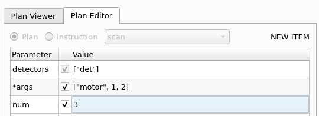
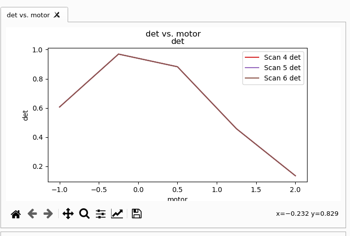

# Bluesky Widgets Demo Quickstart

First, clone this repository

```
https://gist.github.com/danielballan/4969554d0dfbe360c3f13e6b37d9e654 bluesky-widgets-demo-quickstart
cd bluesky-widgets-demo-quickstart/
```

Edit `demo_startup_scripts/80-publishing-and-saving.py` to change
`Broker.named("test")` to the name of the databroker you are using _or_
open `test_databroker_config.yml` and follow the instructions in the comments
to set up a test databroker.

To run a working example...

1. Start Redis.

   ```
   redis-server
   ```

   This is used by the Run Engine Manager to persist the state of the queue and
   restore it after a restart.

2. Start the message bus.

   The message bus receives data streamed out of the Run Engine and provides it
   to any subscribers (such as graphical applications doing live visualiation).

   ```
   bluesky-0MQ-proxy 5577 5578
   ```

   This binary, `bluesky-0MQ-proxy` comes with the Python package `bluesky`.

   For large-scale and/or robust deployments, you should use Kafka for this,
   but 0MQ is lighter and easier to get started with.

3. Start the Run Engine Manager.

   For this example, I recommend aiming it at the startup scripts included with
   this repository, ``demo_startup_scripts/``

   ```
   start-re-manager --startup-dir=demo_startup_scripts/ --keep-re
   ```

   A key setting here is ``--keep-re`` which uses the RunEngine instance defined
   in `demo_startup_scripts/` (and its configuration to publish and save data)
   rather than making a "clean" one to use.

4. Start the app. I suggest playing with `bluesky-widgets-demo` rather than
   `ariadne` because `ariadne` builds in assumptions specific to the BMM
   beamline. It is designed to be an app specifically for BMM.

   ```
   bluesky-widgets-demo --catalog test --zmq localhost:5578
   ```

5. Click "Connect" to connect to the running Run Engine Manager, and click
   "Open" to command the Run Engine Manager to execute the startup scripts
   and, thereby, prepare a Run Engine.

6. Use the plan form to add a plan. This is a little un-ergonomic at the moment.
   See example.

   

   Add the plan to the queue. Click "Start" to process the queue.

7. Switch to the "Databroker" tab. You will see a live plot. (Yes, it would be
   better if this were on the same tab as the data acquisition, as we have done
   in Ariadne.)

   
